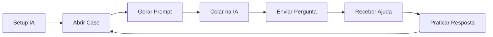

# 🚀 Como Usar o Botão "Gerar Prompt"

## 📌 Visão Geral

O botão **"Gerar Prompt"** permite que você copie automaticamente o conteúdo de um case (STAR + FUPs) formatado e pronto para colar em uma IA (como Claude Sonnet), que te ajudará a responder perguntas de entrevista em tempo real.

---

## ✨ Funcionalidades

✅ **Botão aparece automaticamente** quando você abre um case
✅ **Copia para área de transferência** com um clique
✅ **Suporta PT e EN** - detecta automaticamente o idioma selecionado
✅ **Feedback visual** - mostra "Copiado!" quando bem-sucedido
✅ **Formatação inteligente** - inclui todo contexto necessário para a IA

---

## 📖 Passo a Passo

### **Etapa 1: Setup Inicial da IA** (fazer uma vez)

1. Abra o arquivo [`PROMPT_SETUP_AI.md`](./PROMPT_SETUP_AI.md)
2. Copie o **"PROMPT DE SETUP INICIAL"** (versão em PT ou EN)
3. Cole na sua IA preferida (recomendado: **Claude Sonnet**)
4. Aguarde a confirmação da IA

### **Etapa 2: Durante a Preparação/Entrevista**

1. **Abra um case** no aplicativo (clique em "Ver detalhes")
2. **Clique no botão "Gerar Prompt"** (canto superior direito, ao lado de "Fechar")
3. **Cole o conteúdo copiado** na conversa com a IA
4. **Envie a pergunta do entrevistador** para a IA
5. **Receba sugestões de resposta** personalizadas

---

## 🎯 Exemplo de Uso

### Na Aplicação:
```
1. Você abre o case "Implementação do Sistema de Cache"
2. Clica em "Gerar Prompt"
3. O conteúdo é copiado automaticamente
```

### Na IA (Claude):
```
[Cole o conteúdo copiado]

Você: O entrevistador perguntou: "Como você mediu o sucesso dessa implementação?"

Claude: [Resposta personalizada baseada no seu case]
```

---

## 📋 O Que é Copiado?

O prompt gerado inclui:

```markdown
# CONTEXTO DE ENTREVISTA - LEADERSHIP PRINCIPLES AMAZON

## Princípio: [Nome do Leadership Principle]

**Descrição do Princípio:** [Descrição]

## Case: [Título do Case]

### STAR Framework:

**Situação (Situation):**
[Conteúdo da situação]

**Tarefa (Task):**
[Conteúdo da tarefa]

**Ação (Action):**
[Conteúdo da ação]

**Resultado (Result):**
[Conteúdo do resultado]

**Aprendizado (Learning):**
[Conteúdo do aprendizado]

### Follow-up Questions (FUPs):

**1. [Pergunta 1]**
[Resposta 1]

**2. [Pergunta 2]**
[Resposta 2]

---

**INSTRUÇÕES:**
Estou em uma entrevista para a Amazon e acabei de compartilhar o case acima...
[Instruções detalhadas para a IA]
```

---

## 💡 Dicas Profissionais

### ✅ Melhores Práticas:

- 🎯 **Use uma nova conversa** para cada sessão de preparação
- 📝 **Mantenha o contexto** - não feche a conversa durante a prática
- 🔄 **Peça variações** - "Me dê 3 formas diferentes de responder"
- 💬 **Pratique em voz alta** - não só leia, fale!
- ⏱️ **Use o timer** do aplicativo para simular tempo real

### ⚡ Comandos Úteis para a IA:

```
"Pode ser mais conciso?"
"Adicione mais detalhes técnicos"
"Como eu responderia se o entrevistador parecer cético?"
"E se me pedirem para ser mais específico sobre [X]?"
"Me dê uma versão de 2 minutos e outra de 30 segundos"
```

---

## 🔧 Solução de Problemas

### ❌ O botão não aparece?
- ✅ Certifique-se de que o case está **aberto** (expandido)
- ✅ O botão só aparece quando o case está visível

### ❌ Não copiou para área de transferência?
- ✅ Verifique permissões do navegador
- ✅ Tente usar HTTPS (clipboard API requer contexto seguro)
- ✅ Alguns navegadores podem bloquear em localhost

### ❌ A IA não está respondendo como esperado?
- ✅ Confirme que você enviou o **PROMPT DE SETUP** primeiro
- ✅ Reforce: "Responda como se você fosse eu falando"
- ✅ Peça ajustes específicos conforme necessário

---

## 🌟 Recursos Adicionais

📖 **Documentação Completa**: [`PROMPT_SETUP_AI.md`](./PROMPT_SETUP_AI.md)
🎯 **Leadership Principles**: [Amazon Leadership Principles](https://www.amazon.jobs/content/en/our-workplace/leadership-principles)
💼 **Interview Tips**: Pratique, pratique, pratique!

---

## 🎓 Fluxo Completo de Preparação



1. **Setup** → Configure a IA uma vez
2. **Loop de Prática** → Abra cases, gere prompts, pratique respostas
3. **Iteração** → Repita com diferentes casos e perguntas

---

**Boa sorte na sua entrevista Amazon! 🚀**

*Lembre-se: A IA é uma ferramenta de apoio, mas o conhecimento profundo dos seus próprios cases e experiências é insubstituível!*
