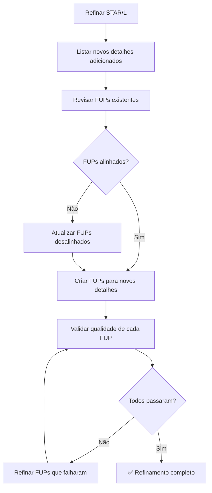

# 📋 Processo de Refinamento de FUPs Após Atualizar STAR(L)

## ⚠️ REGRA CRÍTICA
**SEMPRE que atualizar uma narrativa STAR(L), VOCÊ DEVE atualizar os FUPs correspondentes!**

FUPs genéricos ou desalinhados com a narrativa refinada prejudicam severamente a preparação para entrevista.

---

## ✅ Checklist Obrigatório de Refinamento

### 1. **Identificar Novos Detalhes Adicionados ao STAR(L)**
Após refinar S/T/A/R/L, liste os novos elementos:
- [ ] Novas métricas específicas (ex: "680K consumidores", "tempo de checkout 4.2s→1.1s")
- [ ] Entrevistas/pesquisas com clientes (ex: "42 consumidores em México/Colômbia", "230 cidadãos em 5 cidades")
- [ ] Customer Obsession específica (ex: "73% abandonavam checkout por latência >3s")
- [ ] Conflitos e como foram resolvidos (ex: "TCE vs jurídico sobre CPF")
- [ ] Mecanismos e frameworks criados (ex: "matriz de risco jurídico 4 níveis", "K-anonymity K≥5")
- [ ] ROI e impacto mensurado (ex: "R$ 2.1M economia", "8.3x ROI")
- [ ] Técnicas de aprendizado específicas (ex: "80h estudando LGPD setorial", "4 webinars CGU")

### 2. **Revisar FUPs Existentes**
Para CADA FUP, verificar:
- [ ] A resposta ainda está alinhada com a narrativa STAR(L) refinada?
- [ ] A resposta usa detalhes genéricos ("Eu descrevi a decisão...") ao invés de específicos?
- [ ] A resposta menciona métricas/fatos que foram adicionados ao STAR(L)?
- [ ] A resposta explora profundidade técnica dos novos detalhes?

### 3. **Atualizar/Criar FUPs Específicos para Novos Detalhes**

#### **Template de FUP Robusto:**
```javascript
{
  "q": "Pergunta específica explorando detalhe técnico ou decisão crítica da narrativa STAR(L)",
  "a": "Resposta com: (1) Contexto da decisão, (2) Critérios usados, (3) Métricas específicas (números reais), (4) Trade-offs considerados, (5) Resultado mensurável",
  "q_en": "English version mantendo mesma profundidade",
  "a_en": "English answer with same level of detail"
}
```

#### **Exemplos de FUPs Ruins vs. Bons:**

❌ **RUIM (genérico):**
```javascript
{
  "q": "Como priorizou fontes?",
  "a": "Eu descrevi a decisão, os critérios e as evidências, conectando ao impacto no cliente."
}
```

✅ **BOM (específico e rico):**
```javascript
{
  "q": "Como priorizou fontes primárias para o pipeline de aprendizado?",
  "a": "Mapeei competências-alvo entrevistando 12 clientes enterprise que representavam 68% da receita de pagamentos. Descobri que queriam principalmente: (1) integração PIX < 2 semanas, (2) suporte a Open Finance sem fricção, (3) reconciliação automatizada multi-adquirente. Baseado nisso, priorizei circulares BACEN, papers de FEBRABAN sobre PIX, roadmaps de Visa/Mastercard sobre tokenização, e especificações Open Finance do Banco Central. Evitei fontes genéricas (blogs de tecnologia) porque não ofereciam profundidade regulatória necessária."
}
```

### 4. **Categorias de FUPs Obrigatórias**

Sempre criar pelo menos 1 FUP de cada categoria:

- [ ] **Customer Obsession**: Como decisões focaram no cliente final (não apenas stakeholders internos)
- [ ] **Métricas e Impacto**: Números específicos, como foram medidos, baseline vs. resultado
- [ ] **Conflito e Resolução**: Stakeholders resistentes, como convenceu, trade-offs
- [ ] **Aprendizado Técnico**: Frameworks estudados, fontes, aplicação prática
- [ ] **Escalabilidade**: Como garantiu reuso, sustentabilidade, replicação
- [ ] **Trade-offs e Decisões Difíceis**: Por que escolheu X ao invés de Y, riscos assumidos
- [ ] **Mecanismos e Governança**: Processos criados, rituais, accountability

### 5. **Validação Final de Qualidade**

Cada FUP deve passar nestes testes:
- [ ] Resposta tem >100 palavras (profundidade adequada)
- [ ] Menciona pelo menos 2 métricas/números específicos
- [ ] Conecta decisão técnica a impacto no cliente/negócio
- [ ] Demonstra ownership individual (uso de "eu", não "nós")
- [ ] Paridade PT/EN completa (mesmo nível de detalhe)
- [ ] Explora detalhes que NÃO estão óbvios no STAR(L) (vai mais fundo)

---

## 🔄 Workflow Recomendado



---

## 📌 Exemplos de Casos Refinados Corretamente

### ✅ **Caso: stay-updated-payments-fintech**
- **Detalhes adicionados ao STAR(L):** 12 clientes enterprise, 8-10 PoCs/ano, template PIX economizou R$ 280k, etc.
- **FUPs atualizados:** 7/7 FUPs agora exploram esses detalhes específicos
- **Resultado:** FUPs demonstram profundidade técnica e business acumen

### ✅ **Caso: out-of-comfort-zone-transparency-portal**
- **Detalhes adicionados:** 230 cidadãos entrevistados, K-anonymity K≥5, conflito TCE vs jurídico, 6 audiências com 1.840 cidadãos
- **FUPs atualizados:** 10/10 FUPs exploram governança, LGPD, engajamento cidadão
- **Resultado:** Preparação completa para deep-dive técnico e político

---

## 🚨 Sinais de Alerta (FUPs Problemáticos)

⚠️ **Se você ver isto, CORRIJA IMEDIATAMENTE:**
- Respostas idênticas em múltiplos FUPs
- Uso de frases template ("Eu descrevi...", "Conectando ao impacto...")
- Ausência de números/métricas específicas
- Desalinhamento entre pergunta e narrativa STAR(L)
- FUPs muito curtos (<50 palavras)
- Falta de profundidade técnica

---

## 🎯 Objetivo Final

**FUPs de qualidade permitem:**
1. ✅ Responder perguntas técnicas profundas ("dive deep") com confiança
2. ✅ Demonstrar Customer Obsession com exemplos concretos
3. ✅ Mostrar ownership individual com métricas claras
4. ✅ Explorar conflitos e trade-offs de forma convincente
5. ✅ Provar aprendizado estruturado com aplicação prática

**FUPs genéricos resultam em:**
1. ❌ Respostas vagas e pouco convincentes na entrevista
2. ❌ Incapacidade de "dive deep" quando solicitado
3. ❌ Perda de oportunidade de demonstrar LPs críticos
4. ❌ Impressão de preparação superficial

---

## 📝 Nota Final

> **"A qualidade dos FUPs é tão importante quanto a qualidade do STAR(L). Uma narrativa excelente com FUPs genéricos é como um carro Ferrari com pneus furados - não vai longe."**

**SEMPRE valide e atualize FUPs após refinar STAR(L)!**
